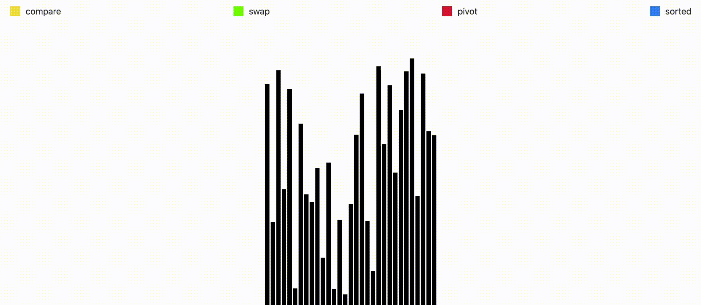

<h1 align="center"> Algorithm Visualizer </h1>

This is a platform to learn how algorithm works by visualizing it. Use object-oriented design (OOD) to make it possible to add new feature in future.

You can check it out on the link below.

https://algorithm-visualizer-dac-6e9f9950d7f7.herokuapp.com/

## Features

1. Pathfinding Algorithm Visualizer

   _Depth First Search (DFS), Breadth First Search (BFS), Dijkstra's Algorithm, A\* Algorithm_

2. Sorting Algorithm Visualizer

   _Bubble sort, Insertion sort, Selection sort, Heap sort, Radix sort, Quick sort, Merge sort_

## Demo

- Pathfinding Algorithm Visualizer - _A\* algorithm_
  

- Sorting Algorithm Visualizer - _Quick sort_
  

## Project setup

```bash
npm install
npm start
```
